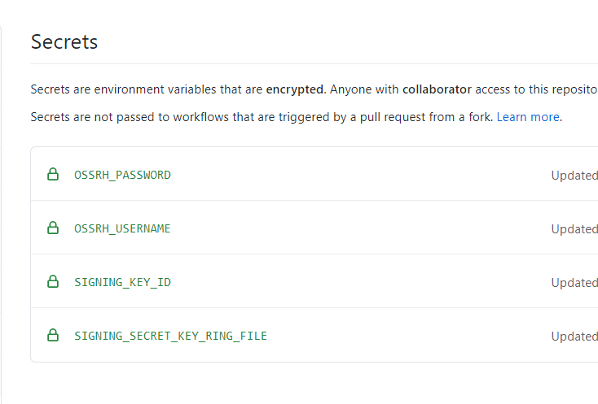

## 摘要
文章内容核心是使用 Gradle 整合 GitHub Actions 自动化发布 Java 项目至 Maven 仓库。文章内是将项目发布至 sonatype 提供的仓库中。如果你需要自动化发布，或者需要将项目同步至 Maven 中央仓库请仔细阅读。

## 前期准备
1. 可同步 Maven 中央仓库的门票，在 [Issues Sonatype](https://issues.sonatype.org/secure/Dashboard.jspa) 上申请；
2. OpenPGP 证书，需要同步至公共的服务器；
3. 一个 Java Project；
4. [GitHub](https://github.com/)。

---

关于同步门票部分可参考提供的[链接](https://central.sonatype.org/pages/producers.html)，文章内主要叙述证书相关的内容。

## OpenPGP 证书
因我使用的 Windows 操作系统这里使用 [Gpg4win](https://www.gpg4win.org/) 工具生成同步证书。如果你使用的是 Mac 或者 Linux 操作系统可使用其它 GPG 工具如 [GnuPG](https://www.gnupg.org/)。

### 安装 Gpg4win
下载地址 [Gpg4win](https://www.gpg4win.org/)。

### 生成证书
```shell
$ gpg --full-generate-key
```

运行上面的命令按照指示生成 RSA 的证书。

```shell
C:\Users\admin>gpg --full-generate-key
gpg (GnuPG) 2.2.23; Copyright (C) 2020 Free Software Foundation, Inc.
This is free software: you are free to change and redistribute it.
There is NO WARRANTY, to the extent permitted by law.

... 省略部分 ...

public and secret key created and signed.

pub   rsa3072 2020-11-10 [SC] [expires: 2021-11-10]
      449B75F00B2DA482AB8D03E8493DA88E2B89E19F
uid                      kk70-blog (blog) <kevinz@weghst.com>
sub   rsa3072 2020-11-10 [E] [expires: 2021-11-10]
```

### 浏览证书
可以使用 `gpg --list-secret-keys --keyid-format SHORT` 命令查询证书列表。
```shell
C:\Users\admin>gpg --list-secret-keys --keyid-format SHORT
C:/Users/admin/AppData/Roaming/gnupg/pubring.kbx
------------------------------------------------
sec   rsa3072/2B89E19F 2020-11-10 [SC] [expires: 2021-11-10]
      449B75F00B2DA482AB8D03E8493DA88E2B89E19F
uid         [ultimate] kk70-blog (blog) <kevinz@weghst.com>
ssb   rsa3072/6B7BF2DA 2020-11-10 [E] [expires: 2021-11-10]
```

### 发布证书
```shell
gpg --keyserver hkps.pool.sks-keyservers.net --send-keys 2B89E19F
```
使用 `gpg` 命令将证书发布到公共服务器 `2B89E19F` 替换为自己证书的 keyid。可在 [http://keys.gnupg.net/](http://keys.gnupg.net/) 网站搜索自己发布的证书。

## Gradle 项目配置
### 配置 Gradle 插件
```groovy
plugins {
  id "maven-publish"
  id "signing"
}
```
要使用 Gradle 发布依赖至 Maven 仓库你至少需要 `maven-publish` 插件。如果需要发布依赖至 Maven 中央仓库还需要使用 `signing` 插件对依赖文件进行签名验证。

## Gradle Publish 配置
```groovy
ext {
  isReleasedVersion = !project.version.endsWith("-SNAPSHOT")
}

publishing {
  publications {
    mavenJava(MavenPublication) {
      from components.java
      artifact sourcesJar
      artifact javadocJar

      pom {
        description = "Yein Chaos Core"
        scm {
          connection = "scm:git:git@github.com:kevin70/chaos.git"
          developerConnection = "scm:git:ssh://github.com/kevin70/chaos.git"
          url = "https://github.com/kevin70/chaos"
        }
      }
    }
  }

  repositories {
    maven {
      credentials {
        username findProperty("ossrhUsername") ?: System.getenv("OSSRH_USERNAME")
        password findProperty("ossrhPassword") ?: System.getenv("OSSRH_PASSWORD")
      }

      if (!isReleasedVersion) {
        url "https://oss.sonatype.org/content/repositories/snapshots"
      } else {
        url "https://oss.sonatype.org/service/local/staging/deploy/maven2"
      }
    }
  }
}
```
* `isReleasedVersion` 将快照版本与正式版本分开提交至不同的 Maven 仓库；
* `publishing.publications.mavenJava` 需要同步的依赖资源；
    * `artifact sourcesJar` 需要发布的源码 jar 包；
    * `artifact javadocJar` 需要发布的 javadoc jar 包；
    * `pom` 自定义 `pom.xml` 文件内容。
* `publishing.repositories` 发布的仓库配置；
    * `maven.credentials` Maven 仓库的认证信息；
    * `maven.url` Maven 仓库的 URL。

## Gradle Singing 配置

```groovy
signing {
  sign publishing.publications.mavenJava
}
```
将需要发布的内容签名 [https://docs.gradle.org/current/userguide/signing_plugin.html](https://docs.gradle.org/current/userguide/signing_plugin.html)。

这里默认采用 [Signatory credentials](https://docs.gradle.org/current/userguide/signing_plugin.html#sec:signatory_credentials) 签名认证方式。

## Github Actions 配置

首先在 `GitHub Project > Settings > Secrets` 中配置一些必要的参数。



以上的所有参数后面都会在 GitHub Workflow 中使用到。

* `OSSRH_USERNAME` 是 sonatype 的登录用户名；
* `OSSRH_PASSWORD` 是 sonatype 的登录密码；
* `SIGNING_KEY_ID` 是 GPG 证书的 ID；
* `SIGNING_SECRET_KEY_RING_FILE` 是 GPG 证书的的秘钥采用 BASE64 编码。

### 获取 SIGNING_KEY_ID
使用 `gpg --list-secret-keys --keyid-format SHORT` 命令获取 `SIGNING_KEY_ID`。
```shell
$ gpg --list-secret-keys --keyid-format SHORT

C:\Users\admin>gpg --list-secret-keys --keyid-format SHORT
C:/Users/admin/AppData/Roaming/gnupg/pubring.kbx
------------------------------------------------
sec   rsa3072/2B89E19F 2020-11-10 [SC] [expires: 2021-11-10]
      449B75F00B2DA482AB8D03E8493DA88E2B89E19F
uid         [ultimate] kk70-blog (blog) <kevinz@weghst.com>
ssb   rsa3072/6B7BF2DA 2020-11-10 [E] [expires: 2021-11-10]
```
其中 `2B89E19F` 为 `SIGNING_KEY_ID`。

### 获取 SIGNING_SECRET_KEY_RING_FILE
将秘钥导出至文件 `secring.gpg`。
```shell
$ gpg --export-secret-keys 2B89E19F > secring.gpg
```
将秘钥文件是二进制的我们需要将内容编码为 BASE64。因为我使用的 Windows 所以下面这个命令我是在 **Git Bash** 中运行的，如果你使用的 Mac 或 Linux 也可以直接运行如下的命令。
```shell
$ base64 secring.gpg > secring.gpg.b64
```
将编码好的文件 `secring.gpg.b64` 中的内容设置在 Secrets 中。

> ⚠️ 因为我生成的证书未设置密码，所以这里缺少了 `passphrase` 配置，如果你的证书是有设置密码的需要额外增加 `passphrase` 的配置。

GitHub Secrets 设置完成，接下来编写 GitHub Action Workflow。

## GitHub Action Workflow
```yml
name: Chaos CI with Gradle

on:
  push:
    branches: [ main ]
  pull_request:
    branches: [ main ]

jobs:
  build:
    runs-on: ubuntu-latest
    steps:
      - uses: actions/checkout@v2
      # 运行 JDK 配置
      - name: Set up JDK 11
        uses: actions/setup-java@v1
        with:
          java-version: 11

      # Gradle 缓存配置
      - name: Cache Gradle packages
        uses: actions/cache@v2
        with:
          path: ~/.gradle/caches
          key: ${{ runner.os }}-gradle-${{ hashFiles('**/*.gradle') }}
          restore-keys: ${{ runner.os }}-gradle
    
      # 给 gradlew 文件授权
      - name: Grant execute permission for gradlew
        run: chmod +x gradlew
    
      # 构建项目
      - name: Build with Gradle
        run: ./gradlew build

      # 将秘钥解码后将文件放置 ~/.gradle/secring.gpg
      - name: Decode
        run: |
          echo "${{secrets.SIGNING_SECRET_KEY_RING_FILE}}" > ~/.gradle/secring.gpg.b64
          base64 -d ~/.gradle/secring.gpg.b64 > ~/.gradle/secring.gpg
      
      # 发布项目
      - name: Publish
        run: ./gradlew publish -Psigning.keyId=${{secrets.SIGNING_KEY_ID}} -Psigning.password= -Psigning.secretKeyRingFile=$(echo ~/.gradle/secring.gpg)
        env:
          OSSRH_USERNAME: ${{secrets.OSSRH_USERNAME}}
          OSSRH_PASSWORD: ${{secrets.OSSRH_PASSWORD}}
```
当任务运行完成之后上 Maven 仓库中确认是否已经发布成功。

---

## 项目链接
[https://github.com/kevin70/chaos](https://github.com/kevin70/chaos)